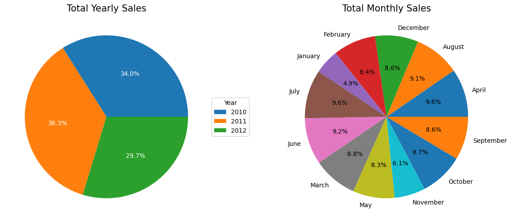
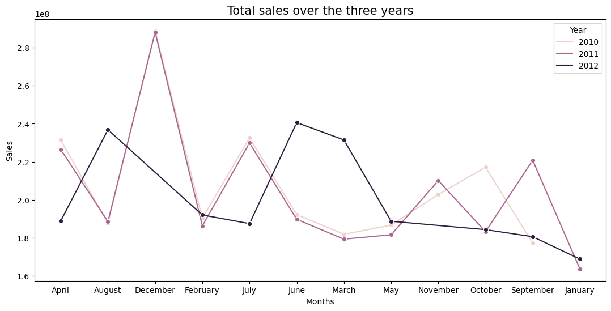
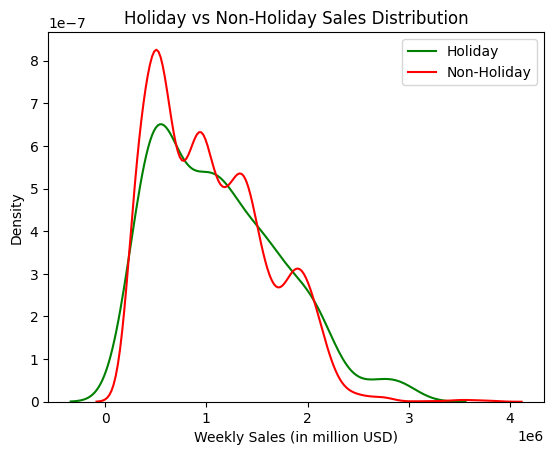

# Walmart Sales: Exploratory Data Analysis

An EDA report that aims to uncover patterns and insights within a Walmart sales dataset. This report includes data cleaning, feature engineering, and hypothesis testing to better understand the relationships between these variables and their impact on sales performance.

For the dataset, click [here](https://www.kaggle.com/datasets/yasserh/walmart-dataset)

### Total yearly and monthly sales

Most yearly sales happened in 2011 with 36% of the total yearly sales over three years. In 2010, sales accounted for 34% of the total. The most recent year, 2012, had the lowest share of yearly sales with 29%. 

The highest monthly sales occurred in July, followed by April and June. The lowest monthly sales were in November and January. This happens due to the challenges associated with the "4th quarter sales," marked by decreased consumer spending post-holiday season, reduced foot traffic, and a shift towards budget-conscious shopping habits after holiday expenses.

### Total sales over three years

In 2010 and 2011, the sales trend was relatively similar, with a slight increase in sales during November 2010, while in 2011 happens later in October. In 2012, the sales trend was more volatile, with a significant increase in sales during June and August.

### Hypothesis Testing

`H0` Holiday weeks don't experience significantly higher sales compared to non-holiday weeks. \
`H1` Holiday weeks experience significantly higher sales compared to non-holiday weeks.

After calculating the mean sales for holiday and non-holiday weeks, we found that holiday weeks have significantly higher sales compared to non-holiday weeks. The $\rho$-value is less than 0.05, which means we can reject the null hypothesis.

## Conclusion

Overall, the dataset appears to be comprehensive, covering relevant attributes for sales analysis. However, its quality could be improved with additional variables like food categories, tax information, etc. These enhancements would offer a more comprehensive understanding of sales dynamics. Moreover, including data on promotions, competitor activities, and store-specific characteristics would enhance the analysis further.